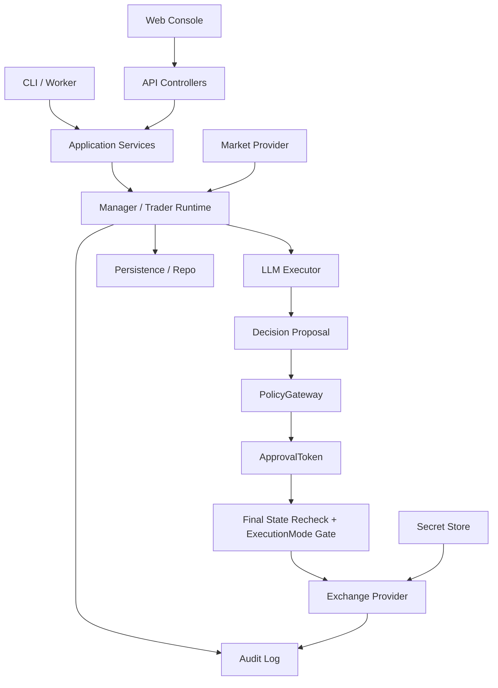

# AstraQuant Architecture

本文档定义 AstraQuant 的总体架构、模块边界、状态流转和共享契约。它用于后续多线程并行开发时统一认知。

## 1. 项目目标

AstraQuant 是一个 AI-native crypto trading platform。目标不是让大模型绕过程序直接交易，而是让大模型提出交易意图，再经过确定性的策略网关、审批 token、执行模式闸门、审计日志和交易所适配层，最终进入模拟盘、测试网或显式开启的实盘。

核心原则：

- AI 可以决策，但不能直接下单。
- 默认 paper/testnet，live 必须显式双确认。
- 每一笔交易必须可追溯、可解释、可回放。
- 风控和执行规则必须在代码层强制执行，不能只写在 prompt 里。
- 所有外部 provider、secret、API contract 都必须有稳定边界。

## 2. 当前代码结构

主要目录：

- `go/`: Go 后端核心。
- `go/pkg/manager/`: trader 生命周期、决策循环、PolicyGateway、执行编排。
- `go/pkg/executor/`: LLM 决策执行器、prompt 渲染、决策结构校验。
- `go/pkg/exchange/`: 交易所接口和 provider 实现。
- `go/pkg/market/`: 行情 provider 接口和实现。
- `go/internal/model/`: DB model 层。
- `go/internal/persistence/`: 决策、持仓、行情、审计相关持久化。
- `go/pkg/repo/`: 仓储层，封装模型与配置读写。
- `go/internal/handler/`, `go/internal/logic/`, `go/internal/svc/`: API 服务分层。
- `web/`: 前端。
- `mcp/`: MCP/工具集成。
- `.github/workflows/`: CI。
- `gitbook/`, `markdown/`, `go/docs/`: 文档。

## 3. 推荐目标架构



关键执行链路：

1. Trader 定时或手动触发决策。
2. Executor 生成 `FullDecision`。
3. Executor validator 校验格式、置信度、杠杆、RR、风险参数。
4. Manager 收到 `decisionErr` 时不得执行 payload。
5. PolicyGateway 对通过 validator 的决策再次做硬审批。
6. PolicyGateway 生成短期 `ApprovalToken`。
7. 执行前同步仓位并复查 symbol 归属、持仓数量、执行模式。
8. Exchange Provider 提交订单。
9. Audit/Persistence 记录全链路事件。

## 4. 模块拆分与边界

### 4.1 Runtime Manager 模块

负责：

- Trader 生命周期：注册、启动、暂停、停止。
- 决策循环调度。
- PolicyGateway 调用和 ApprovalToken 执行编排。
- 持仓同步、虚拟 trader 隔离、最终执行前复查。

不负责：

- LLM API 具体调用。
- 交易所 HTTP/WebSocket 细节。
- 前端页面实现。
- Secret 持久化实现。

允许修改：

- `go/pkg/manager/**`
- 与 manager 测试直接相关的 `go/pkg/manager/*_test.go`

禁止修改：

- `go/pkg/exchange/**`，除非协调线程授权。
- `go/pkg/executor/**`，除非契约已稳定并获得授权。
- `web/**`

共享文件，必须协调后修改：

- `go/etc/manager.yaml`
- `go/nof0.api`
- `go/internal/svc/servicecontext.go`
- `go/pkg/manager/config.go`

### 4.2 Policy / Risk 模块

负责：

- 硬风控规则。
- ApprovalToken 生成与验证。
- execution mode / live gate。
- 每笔订单的策略拒绝原因。

不负责：

- 实际交易所下单。
- UI 展示。
- 大模型 prompt 内容。

允许修改：

- `go/pkg/manager/policy.go`
- `go/pkg/manager/*policy*_test.go`
- `go/pkg/manager/manager_guard_test.go`

共享文件，必须协调后修改：

- `go/pkg/manager/config.go`
- `go/pkg/executor/types.go`
- `go/schemas/**`

### 4.3 Secret / Credential 模块

负责：

- Secret store 接口。
- 本地开发 secret provider。
- 每个 trader/session 的凭据上下文。
- 防止前端和全局环境变量泄露交易密钥。

不负责：

- UI 表单样式。
- 交易策略。
- exchange provider 的业务下单逻辑。

允许修改：

- `go/internal/secrets/**`，新目录。
- `go/pkg/exchange/**` 中与 credential 注入相关的接口适配，需事前协调。
- `go/internal/svc/servicecontext.go`，需协调。

禁止修改：

- `web/**`，除非与 UI 线程有 contract。
- `go/pkg/manager/policy.go`，除非新增 secret policy contract 已协调。

共享文件：

- `go/etc/exchange.yaml`
- `go/.env.example`
- `go/internal/svc/servicecontext.go`

### 4.4 Audit / Persistence 模块

负责：

- AI 决策、审批、拒绝、下单、成交、错误的审计日志。
- 可回放的数据结构。
- DB 表、repo、persistence service。

不负责：

- 下单风控判断本身。
- 前端图表设计。
- 交易所 provider。

允许修改：

- `go/internal/persistence/**`
- `go/pkg/repo/**`
- `go/internal/model/**`
- `go/migrations/**`

共享文件，必须协调：

- `go/internal/model/generated_compat.go`
- `go/internal/svc/servicecontext.go`
- `go/pkg/manager/persistence.go`
- 任何 DB schema/contract 文档。

### 4.5 Paper Trading / Exchange 模块

负责：

- 模拟盘 provider。
- 手续费、滑点、保证金、PnL、reduce-only、仓位计算。
- exchange provider contract 测试。

不负责：

- LLM 决策。
- 前端。
- API controller。

允许修改：

- `go/pkg/exchange/sim/**`
- `go/pkg/exchange/interface.go`，仅在 contract 已协调后。
- `go/pkg/exchange/*_test.go`

禁止修改：

- `go/pkg/manager/**`，除非 contract 已批准。
- `web/**`

共享文件：

- `go/pkg/exchange/interface.go`
- `go/pkg/exchange/types.go`
- `go/etc/exchange.yaml`

### 4.6 API / Application Service 模块

负责：

- HTTP/API contract。
- controller/logic/service 分层。
- Trader 管理 API、决策记录 API、订单/持仓 API、审计 API。

不负责：

- manager 内部交易逻辑。
- UI 组件实现。
- DB 底层细节。

允许修改：

- `go/internal/handler/**`
- `go/internal/logic/**`
- `go/internal/types/**`，如存在。
- `go/nof0.api`

共享文件：

- `go/internal/svc/servicecontext.go`
- `go/pkg/manager/**` 的 public method contract。
- `go/pkg/repo/**` 的 repository contract。

### 4.7 Web Console 模块

负责：

- 控制台 UI。
- Trader 列表、启动/暂停、决策记录、审计记录、持仓、收益曲线。
- 调用后端 API。

不负责：

- 后端业务规则。
- 交易所下单。
- secret 明文持久化。

允许修改：

- `web/**`

禁止修改：

- `go/**`，除非 API contract 已协调。

共享文件：

- API contract 文档。
- OpenAPI 或 `go/nof0.api` 生成结果。

### 4.8 LLM / Decision Intelligence 模块

负责：

- 多模型投票。
- Prompt 版本管理。
- 决策 schema。
- 反方审查和策略记忆。

不负责：

- 交易所执行。
- 密钥存储。
- 前端页面。

允许修改：

- `go/pkg/executor/**`
- `go/schemas/**`
- `go/etc/prompts/**`

共享文件：

- `go/pkg/executor/types.go`
- `go/pkg/manager/buildExecutorContext` 相关上下文结构。
- Prompt 版本 contract。

### 4.9 Intelligence Ingestion 模块

负责：

- 将 Telegram/X/公告/新闻情报接入交易上下文。
- 与已有 `alpha-trading-bot` 的数据结构对齐。
- 提供可检索、可评分的 market intelligence context。

不负责：

- 下单。
- Web UI。
- LLM provider 底层调用。

允许修改：

- 未来新目录：`go/internal/intel/**`
- 未来新目录：`go/pkg/intel/**`
- 与 `alpha-trading-bot` 的 adapter 文档。

共享文件：

- Executor context contract。
- DB migration。
- API contract。

### 4.10 DevEx / CI / Release 模块

负责：

- CI。
- lint/test matrix。
- secret scan。
- Docker Compose。
- README、启动脚本、贡献指南。

不负责：

- 业务功能实现。

允许修改：

- `.github/**`
- `go/Makefile`
- `go/docker-compose.yml`
- `README.md`
- `NOTICE.md`
- 文档文件。

共享文件：

- `.gitignore`
- 根 README。
- license/notice 文件。

## 5. 状态流转

Trader 状态：

```text
stopped -> running -> paused -> running
running -> stopped
running -> error
paused -> stopped
error -> stopped
```

Decision 状态建议：

```text
generated
validated
policy_rejected
approved
submitted
filled
cancelled
failed
reconciled
```

Order 状态建议：

```text
proposed
approved
submitted
accepted
partially_filled
filled
cancelled
rejected
failed
```

任何线程新增状态必须：

- 更新状态定义文档。
- 更新 API contract。
- 更新测试。
- 在中文交接说明中注明兼容性影响。

## 6. Contract 优先级

共享 contract 变更必须先于业务实现稳定：

1. API request/response。
2. DB schema。
3. manager/executor/exchange interface。
4. audit event schema。
5. frontend DTO。

未稳定 contract 的线程只能做内部草稿，不得推送到共享主线。

